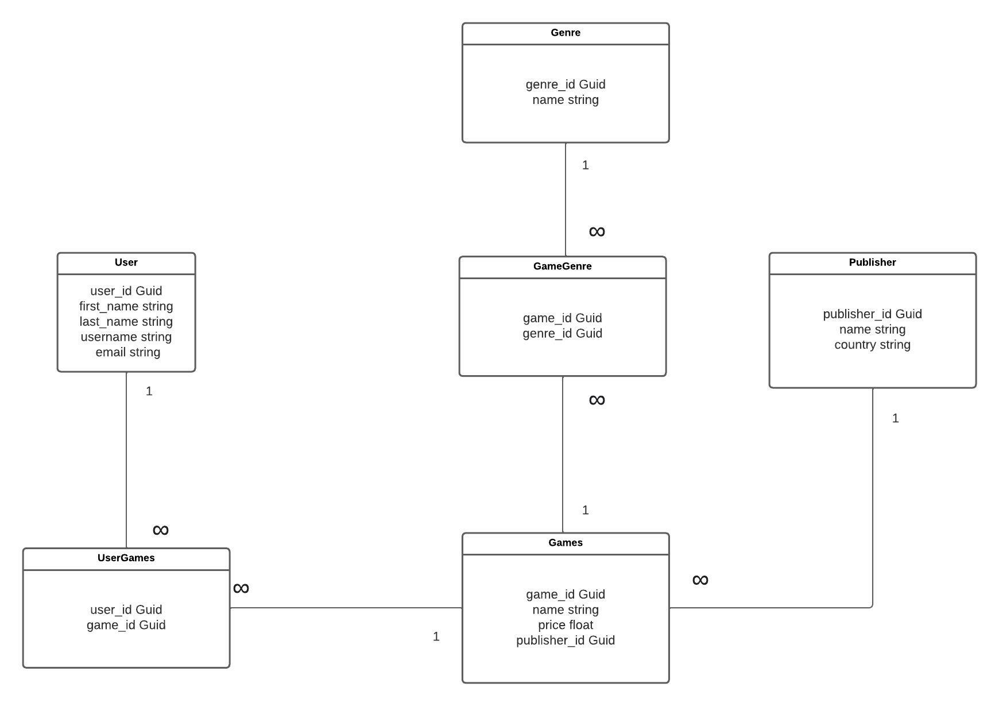

# Game database

Een database die gebruikers, games, genres en gamepublisher kan bijhouden, aanpassen en verwijderen.

## Relaties

- Een gebruiker kan meerdere games hebben
- Een game kan meerdere gebruikers hebben
- Een game kan meerder genres hebben
- Een genre kan meerdere games hebben
- Een game heeft één publisher
- Een publisher kan meerdere games hebben

## User

Een gebruiker kan alleen een bestaande game toevoegen aan een lijst van games dat hij speelt.
Een gebruiker kan een game verwijderen uit zijn lijst.
Hij kan ook zijn gebruikersnaam, naam en voornaam aanpassen, ophallen en kan zichzelf verwijderen.

Gebruiker bevat:
- Een id
- Een voornaam en een achternaam
- Een gebruikersnaam
- Een email

## Publisher

Een publisher kan een game aanmakken, aanpassen en verwijderen.
Hij kan de genres van de game ook aanpassen.
Publishers kunnen hunzelf aanmaken, aanpassen en verwijderen.

Publisher bevat:
- Een id
- Een naam
- Een land

## Genre

Een genre van een game is verbonden aan games. Alleen een publisher kan de genre van een game aanpassen/toevoegen/verwijderen.
Een user kan de genres zien en opvragen maar niet aanpassen.

Een genre bevat:

- Een id
- Een naam

## Games

Een game kan alleen aangemaakt door een publisher.
Zij kunnen het ook aanpassen en verwijderen.
Een user kan de genres zien en opvragen maar niet aanpassen.

Een game bevat:
- Een id
- Een naam
- Een prijs
- Een publisher